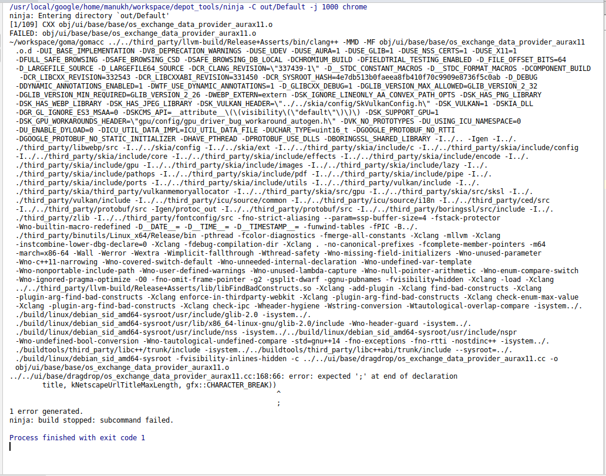
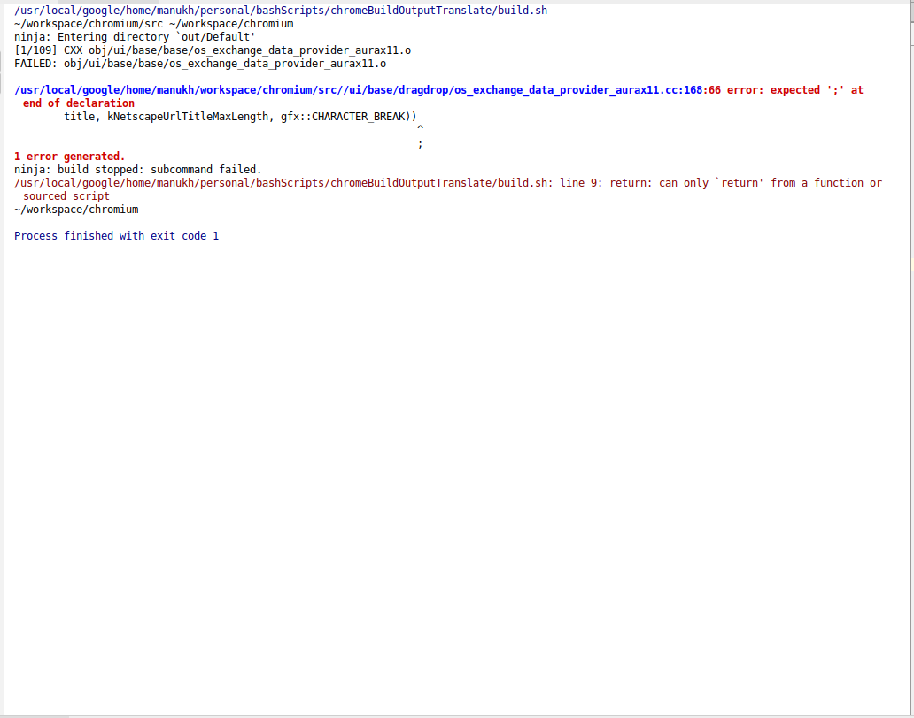
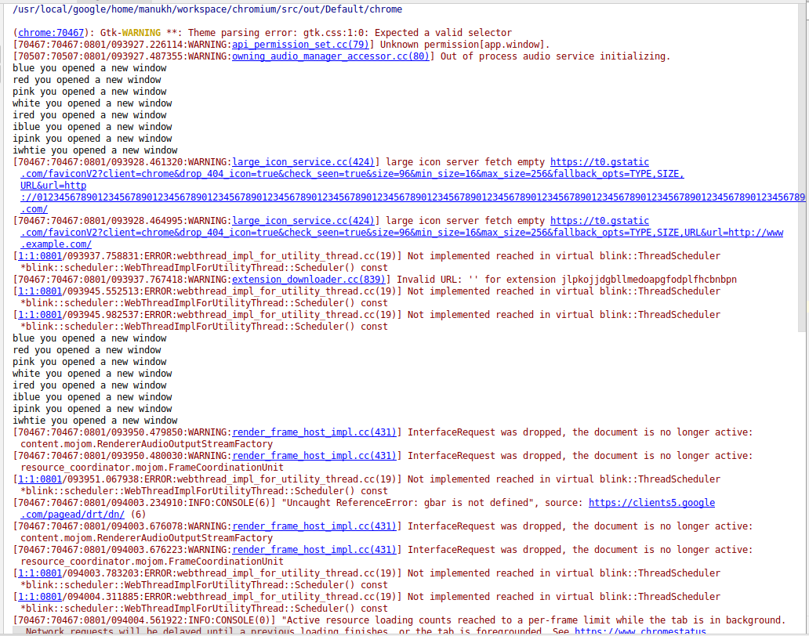
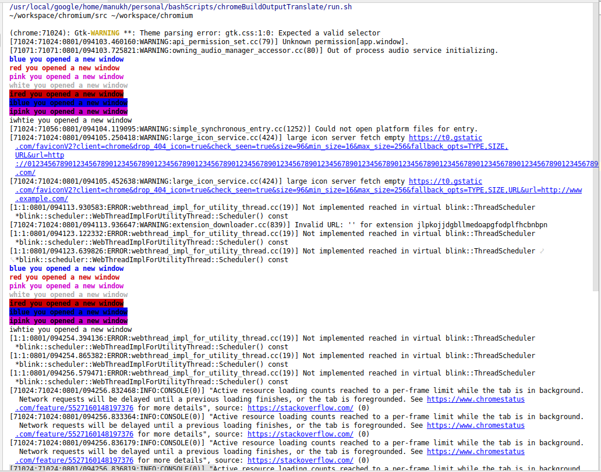
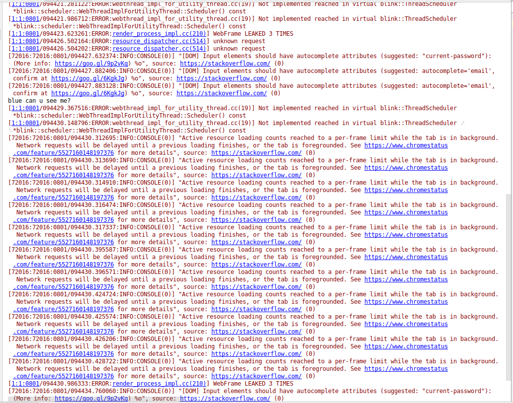
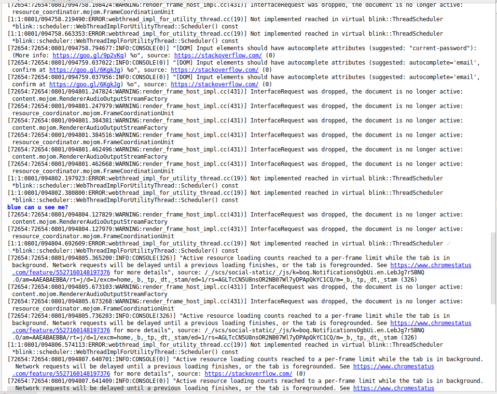
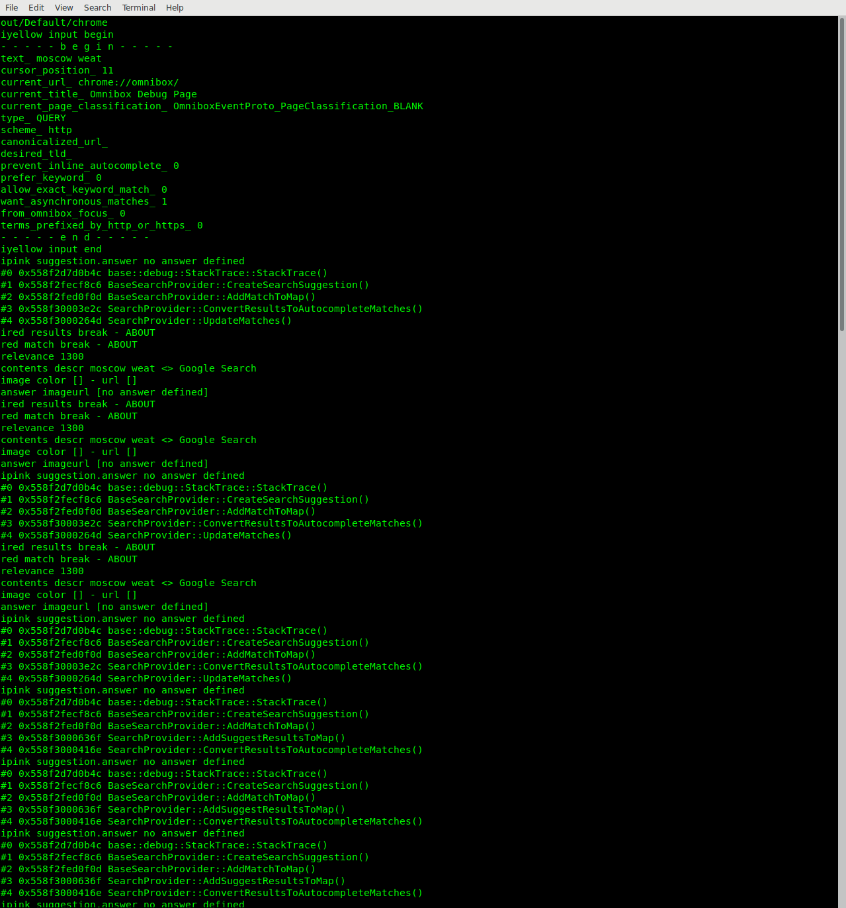
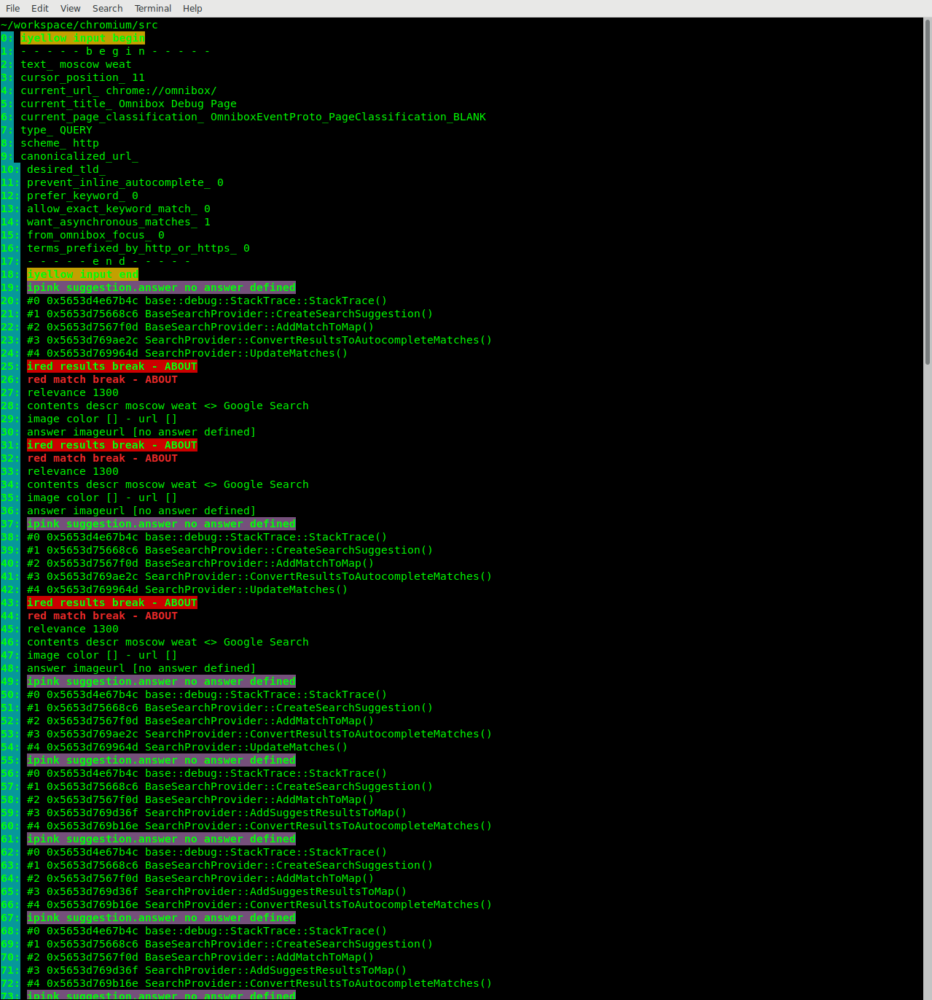
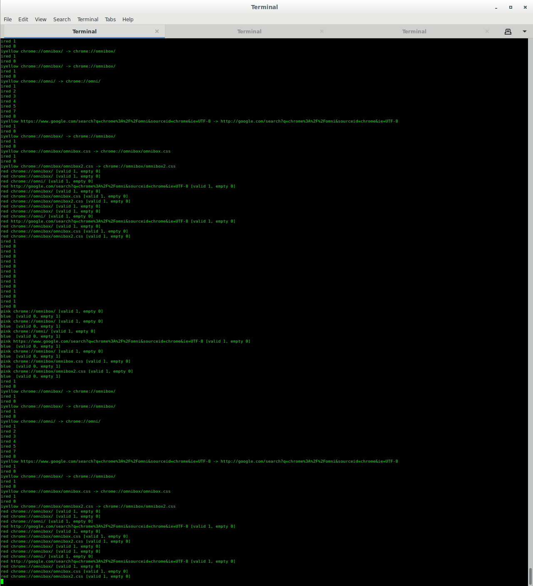
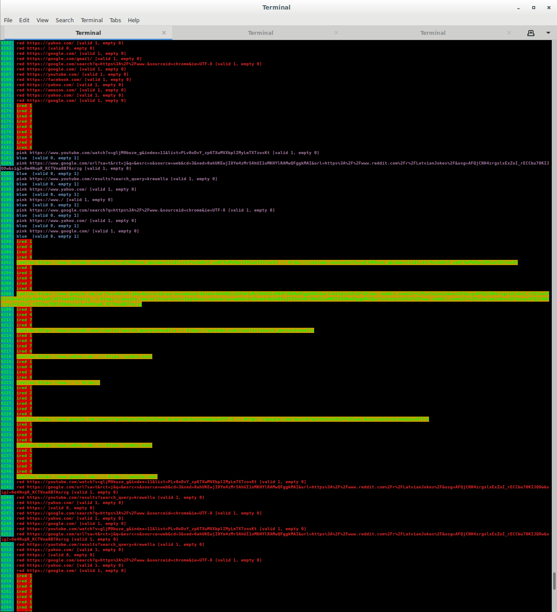

# output transformations

## Intro

This serves 2 purposes:

1. slightly modify the ninja build output to allow clion interpretation

1. slightly modify the chrome output to make debug output easier to identify

## build.sh

`./build.sh` will simply pipe the ninja build output to `translatePaths.js` which will in turn do 3 things:

1. will remove goma output (lines which begin with `~/workspace/goma/gomacc`) to avoid cluttering the output

1. will replace relative file paths with absolute file paths to allow clion (and other ide's) to link the files.

1. will print error messages with bold red styling. ninja already seems to do this by default in certain terminals, but whatever means it usees isn't compatible with clion's terminal, so we instead use bash coloring (e.g. `\033[1;31m`)    

#### normal

#### with transformations

## run.sh

`run.sh` will simply pipe the output of running the built chrome executable to `translateRunColors.js` which will in turn:

1. style all output that is prefixed by a supported style name

1. prefix line numbers

1. remove less useful output (regex `/^\[\d+:\d+:\d+\/\d+\.\d+:.*$/`)

supported colors:

- `black`
- `red`
- `green`
- `yellow`
- `blue`
- `pink`
- `cyan`
- `white`
- `iblack`
- `ired`
- `igreen`
- `iyellow`
- `iblue`
- `ipink`
- `icyan`
- `iwhite`
- `lblack`
- `lred`
- `lgreen`
- `lyellow`
- `lblue`
- `lpink`
- `lcyan`
- `lwhite`

#### usage example

`printf("iwhite the unicorn hid the elephant's rainbow under the moon's flower\n");`

#### normal 1

#### with transformations 1

#### normal 2

#### with transformations 2

#### normal 3

#### with transformations 3

#### normal 4

#### with transformations 4

## buildAndRun.sh

does equivelent of `build.sh`, and, if successfull, then `run.sh`.

## terminal

these scripts work fine in terminal as well. If you're primary use case is the terminal, you may want to modify `translatePaths.js` to output terminal-compatible links instead of ide-compatible links. Whereas ide's desire `/absolute/path/src/my_c_file.c:line#`,
terminals desire `file//...` with no appended line #
