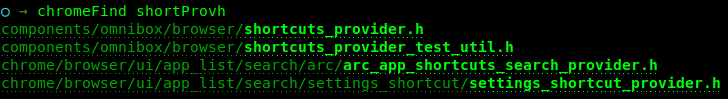
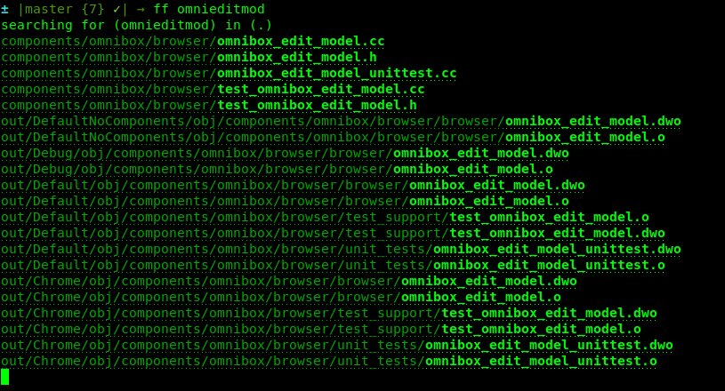

# gif


# what's it do?

fuzzy search paths & files names

e.g. `yellow` would match with

`yellowBook.txt`

`yellowRock.txt`

`yell_only_when_you_need_to.txt`

`yex_lx_yx_lx_owx.txt`

etc.

### setup

1. sourcing

    in ur bash profile source the `findFile.sh` script
    ```
    . /usr/local/.../findFile/findFile.sh
    ```
1. chrome path

    modify the variable `chromeSrc` in `findFile.sh` (line 1) to your actual path

### usage

`findFile <optional search dir> <search text>` (alias `ff`)

`chromeFind <search text>` (alias `cf`)

### examples

in ur terminal

`ff myFuzzyFileName.txt` will search for `myFuzzyFileName.txt` in ur current dir

`ff mfinam` will search for `mfinam` which will match `myFuzzyFileName.txt` if such a file exists

`ff myDir mfinam` will search for `mfinam` in `myDir`

`cf shortProvh` will search for `shortProvh` in your chrome dir

```sh
> cf shortProvh
components/omnibox/browser/shortcuts_provider.h
components/omnibox/browser/shortcuts_provider_test_util.h
chrome/browser/ui/app_list/search/arc/arc_app_shortcuts_search_provider.h
chrome/browser/ui/app_list/search/settings_shortcut/settings_shortcut_provider.h
```

### screenshot





### links

ctrl + click on output to open file in the default application for that file type

some terminals won't support this, but most should
