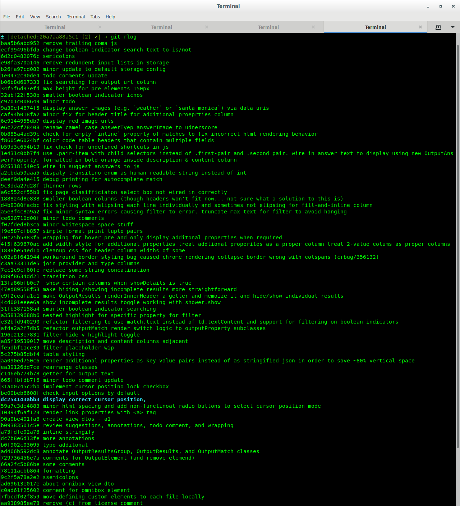
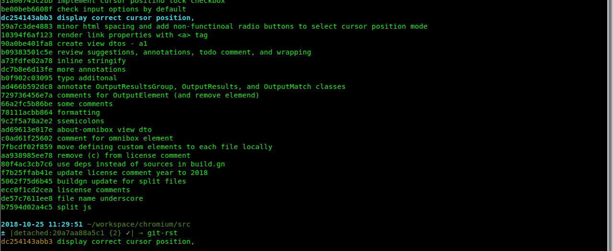
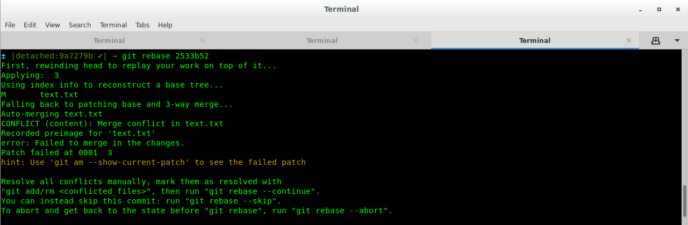

# git-r

help visualize git rebases

## screenshots





## why

1. easier to read than git rebase's output

    

1. easier to type than a custom git log command

    `git log --pretty=oneline --abbrev-commit 2533b52^..9a7279b`

## setup

save and source the script

e.g., if ur using `bash`, add `. <save path>/git-r.sh` to ur `.bashrc` file

## commands

### `git-rst` or `git-rebase-status`

prints the commit being applied in the format `<commit sha> <commit message>`

```bash
→ git-rst
90a0be401fa8 the red elephant flies the farthest
```

### `git-rlog` or `git-rebase-log`

prints the commits from the rebase base commit (the commit ur rebasing onto) to rebase head commit (the commit ur rebasing), and highlights the commit currently being applied

```bash
→ git checkout rainbows
...

→ git rebase base
...

→ git-rlog
c9701c008649 include ultraviolet colors
9a30ef4674f5 make them brighter
caf94b018fa2 paint the rainbows < this line will be highlighted
```


### `git-rcont` or `git-rebase-continue`

adds unstaged changes and invokes `git rebase --continue` followed by `git-rlog`

this is meant to save some typing for the typical rebase workflow
