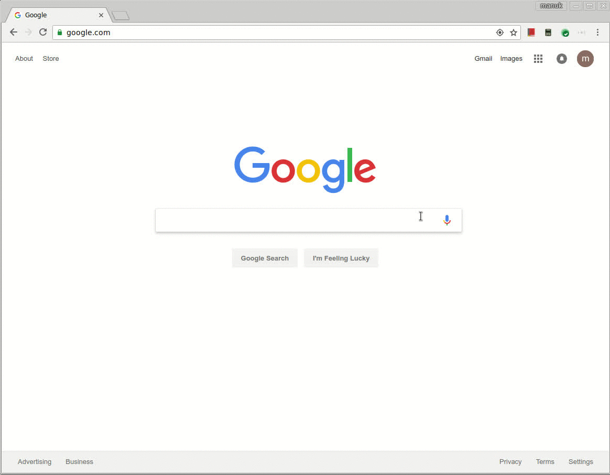
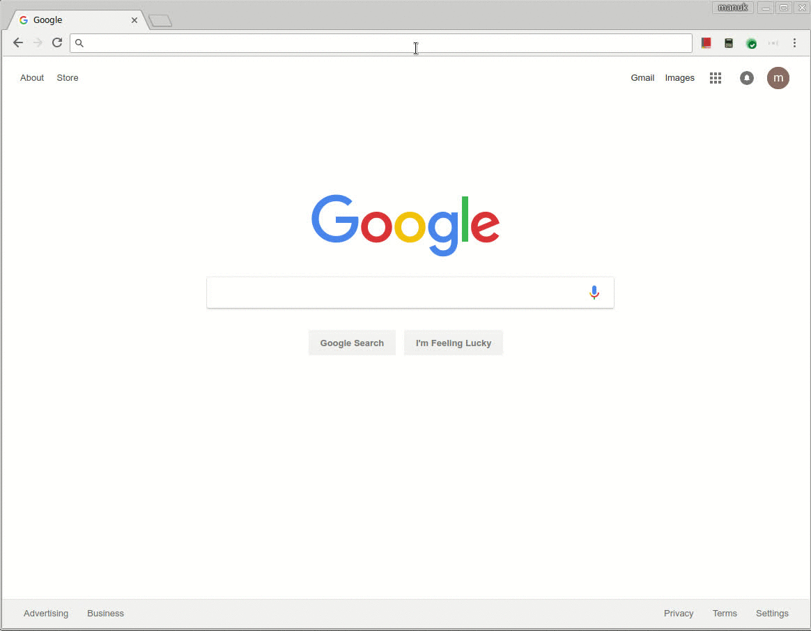
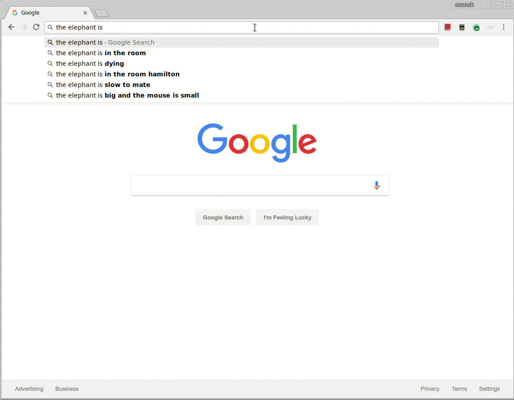
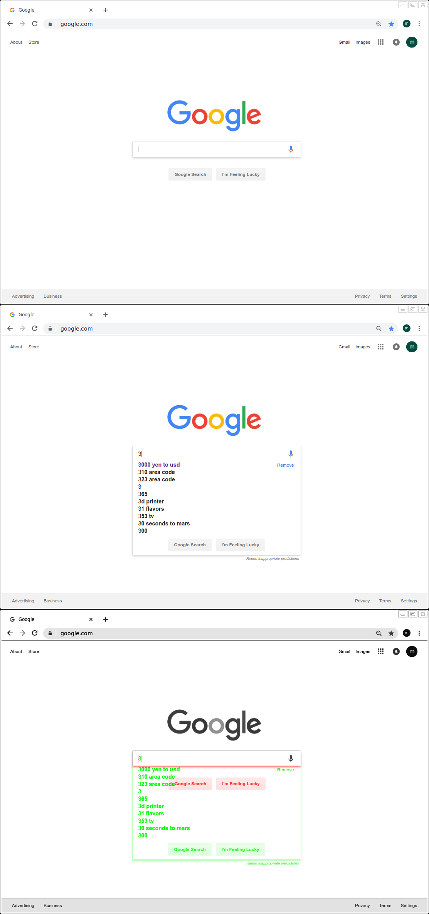
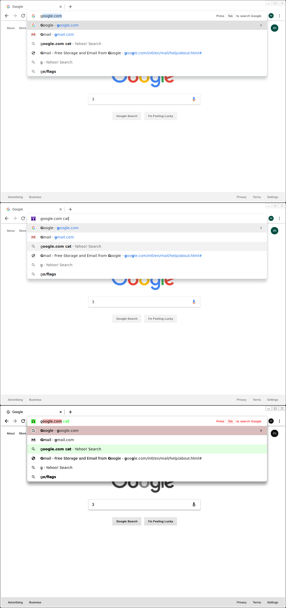
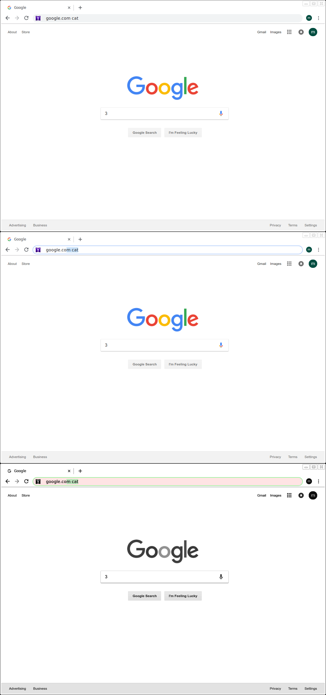
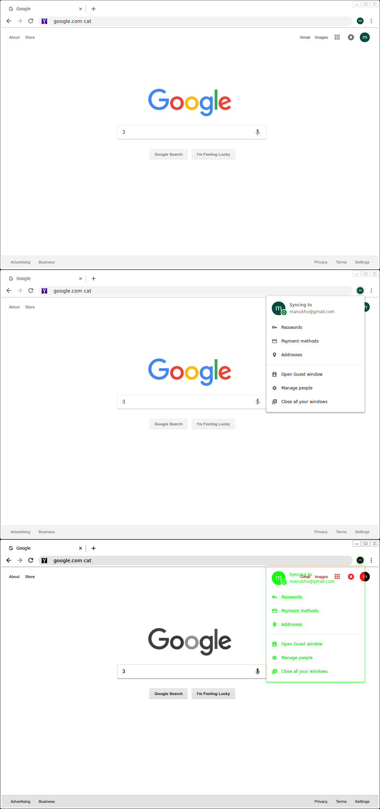
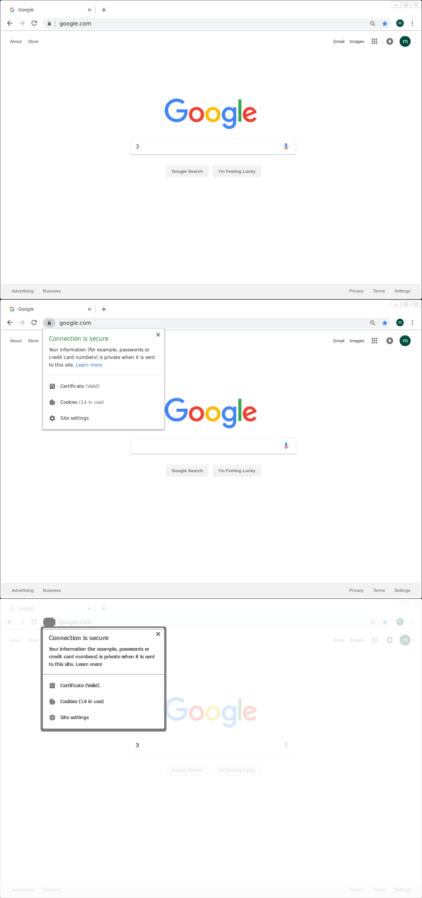

# Image Compare

overlays 2 images and highlights differences.

## examples

## image names

the script can create 4 `png` files named:

- `base.png`, base image

- `temp.png`, comparison image

- `display.png`, overlay image

- `concat.png`, the 3 above concatenated as in the screenshots above

## commands

- `compareImages.sh base` captures base image from currently focused window

- `compareImages.sh` 1. captures comparison image from currently focused window, 2. compares captured comparison image with last captured base image to generate the overlay image, 3. and displays the overlay image.

- `compareImages.sh diff` same as above, but uses green & red to highlight removals & additions respectively. see the first 4 screenshots for examples.

- `compareImages.sh kill` kills all opened displays. useful when u find urself with 10+ overlay images open

## useful bindings

i've found the following keyboard shortcuts useful:

- `window + 1` to `path/imageCompare/compareImages.sh diff`

- `window + 2` to `path/imageCompare/compareImages.sh`

- `window + 3` to `path/imageCompare/compareImages.sh diff`

- ``window + ` `` to `path/imageCompare/compareImages.sh kill`
