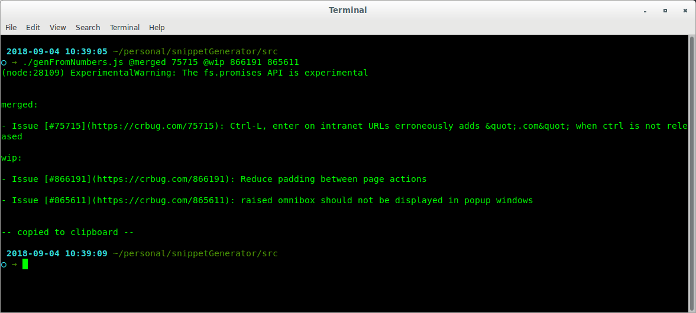
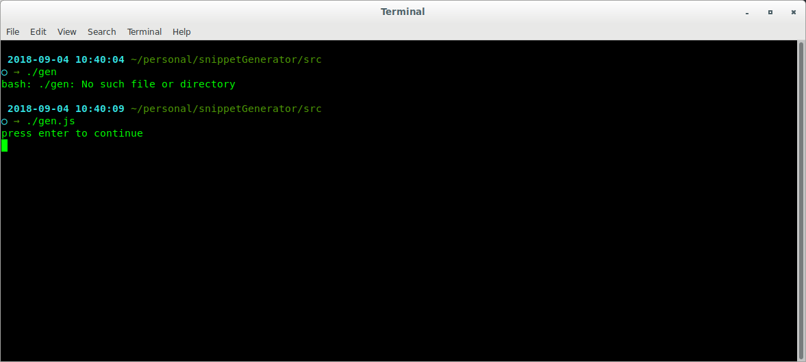

# snippet generator

## overview

- The `genFromNumbers` script is quicker to use.

- The `gen` script allows for more customizable snippets and remembering the input from previous use.

## cli usage, `genFromNumbers.js`

### example

`./genFromNumbers.js @merged 75715 @wip '866191 dis iz important' 865611 'other important stuff'`

will produce the following output and set your clipboard:

```
merged:

- Issue [#75715](https://crbug.com/75715): Ctrl-L, enter on intranet URLs erroneously adds &quot;.com&quot; when ctrl is not released

wip:

- Issue [#866191](https://crbug.com/866191): dis iz important

- Issue [#865611](https://crbug.com/865611): raised omnibox should not be displayed in popup windows

- other important stuff
```

### details

- maps `@my header` to `my header:`

- maps `0123` to `- Issue [#0123](https://crbug.com/0123): <title fetched from monorail>`

- maps `0123 custom message` to `- Issue [#0123](https://crbug.com/0123): custom message`

- maps `custom message` to `- custom message`

### screenshots




## interactive usage, `gen.js`

### example

`./gen.js`

will open a text editor (`gedit` by default) and prompt you for further input.

Enter the following and save:

```
merged:

- [830491]: my first issue

- [75715]: i dont remember the title, but the script will find it for me: !... (^v^)

in progress:

- [632215]: this issue depends on [848591]

- some other stuff
```

Switching back to the terminal and pressing `enter` will produce the following output and set your clipboard:

```
merged:

- [#830491](https://crbug.com/830491): my first issue

- [#75715](https://crbug.com/75715): i dont remember the title, but the script will find it for me: Ctrl-L, enter on intranet URLs erroneously adds &quot;.com&quot; when ctrl is not released (^v^)

in progress:

- [#632215](https://crbug.com/632215): this issue depends on [848591](https://crbug.com/848591)

- some other stuff
```

### details

- maps `[0123] other text !... more text` to `[#0123](https://crbug.com/0123) other text <title fetched from monorail> more text`

- maps `[0123]` to `[#0123](https://crbug.com/0123)`

### screenshots





## note for non-linux use

by default, the scripts use `xclip` for setting the clipboard, and `gedit` for prompting for text input (`gen.js` only). These should be customized to ur preferred text editor / clipboard server for other os's; see the `setClipboard` and `writeUserFile` functions in the src.

## note for `restricted` issues

some monorail issues r restricted and require authentication to view and fetch titles from. By default, they will simply display their issue number as their title, e.g. `[#632215](https://crbug.com/632215): 632215`, as well as console a warning `-- unable to fetch title for issue 632215, missing authentication, it may be a 'Restricted' issue, try setting a cookie --`. to work around this issue, you may create a `headers.json` file in this directory (1 level up from `src`) containing something like
```
{
    "Cookie": "SACSID=~AJKiY...iAXgk"
}
```
this can be fetched from your browser developer console
